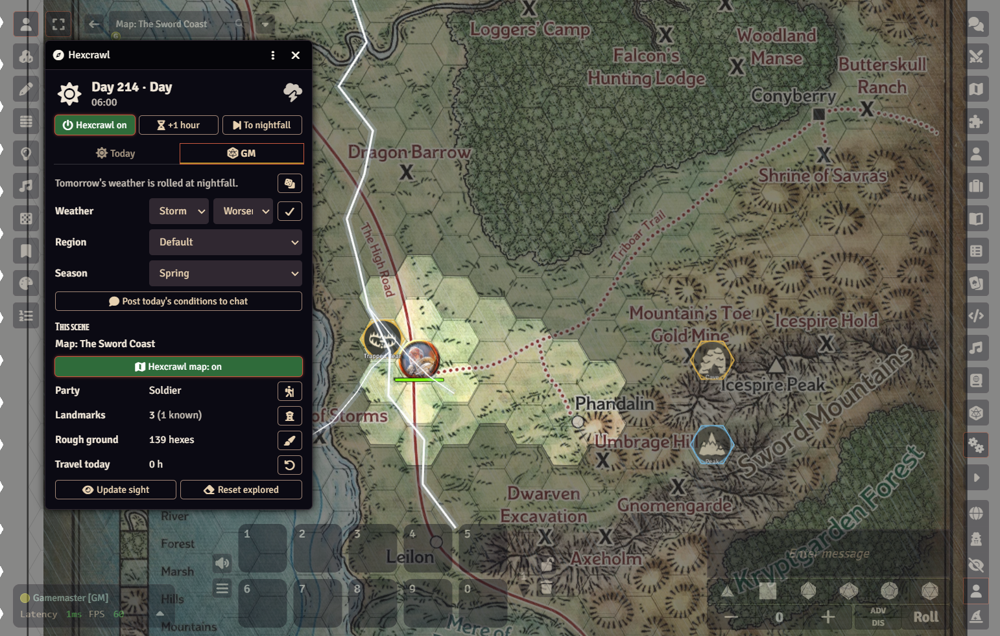
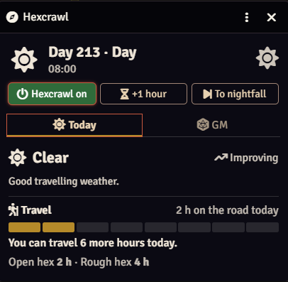
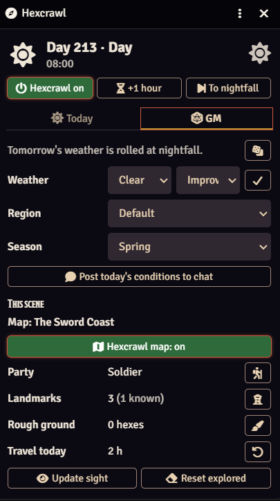
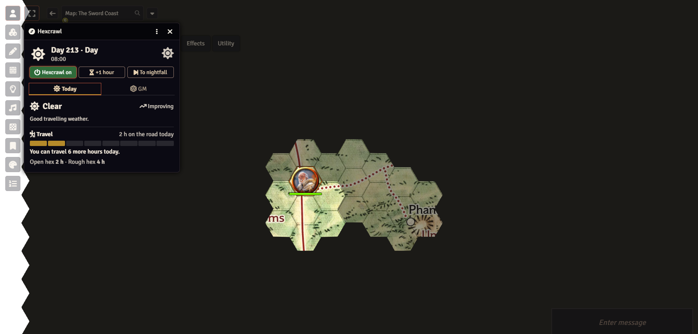
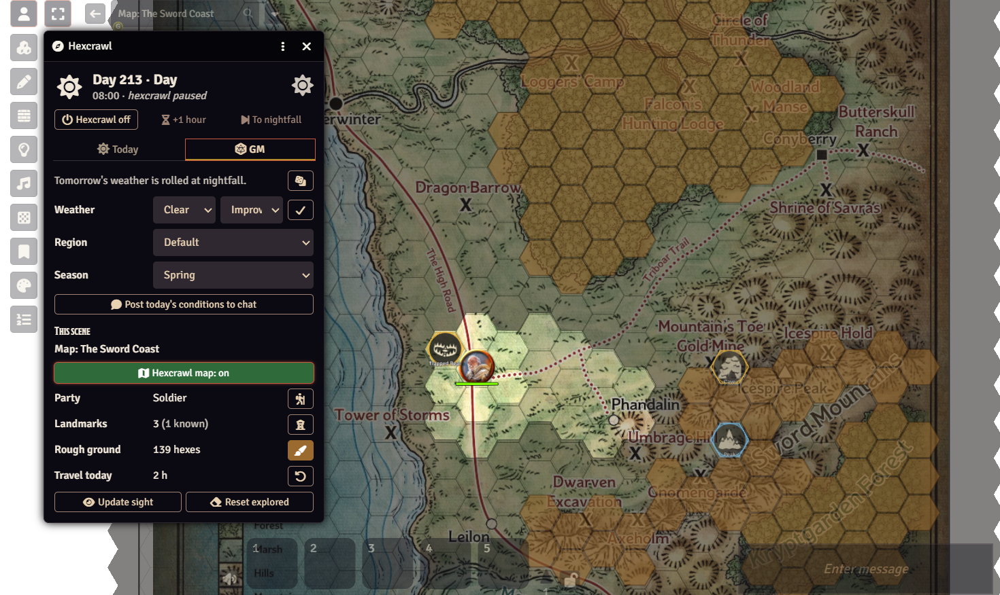
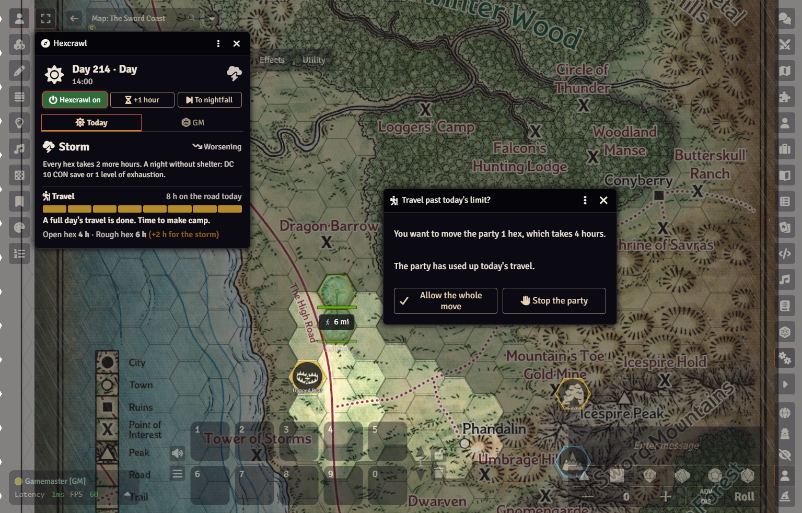
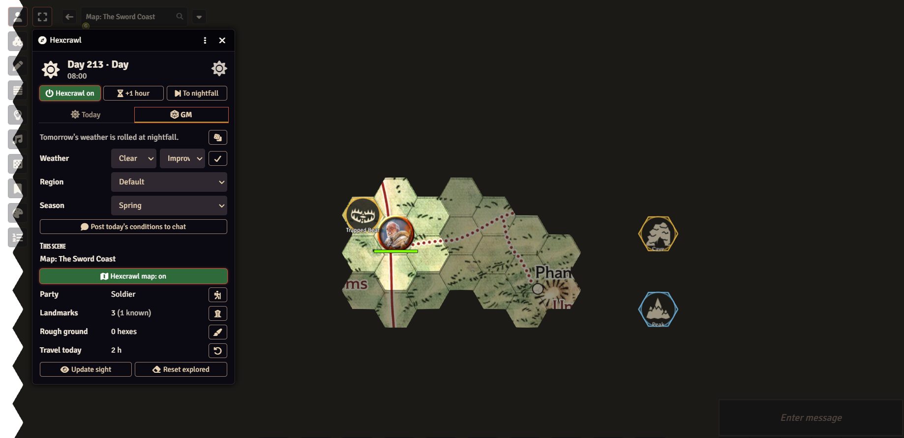

# Explorer's Hexcrawl


Move the party token and Explorer's Hexcrawl keeps track of the rest. It spends travel time, rolls the weather each night, reveals the map hex by hex, and tells everyone when the party finds something worth a closer look. The rules are deliberately light. There are no navigation rolls, temperature bands or pace tables: the party always goes where it means to, and bad weather only slows it down.



---

## Contents

- [Features](#features)
- [Installation](#installation)
- [Quick start](#quick-start)
- [How it plays](#how-it-plays)
- [Travel](#travel)
- [Weather](#weather)
- [Landmarks](#landmarks)
- [Regions](#regions)
- [Day and night](#day-and-night)
- [Settings](#settings)
- [Keyboard shortcuts](#keyboard-shortcuts)
- [Macro API](#macro-api)
- [Upgrading from older versions](#upgrading-from-older-versions)
- [Known limitations](#known-limitations)
- [License and credits](#license-and-credits)

---

## Features

 **Automatic travel time.** Every hex the party enters moves the clock on: 2 hours for open ground and 4 for rough ground, plus extra hours in rain or storms. You paint the rough hexes once with a brush.
 **Travel limits with GM approval.** The party can't travel at night, past nightfall, or beyond the day's 8 hours. A move that would is stopped, and the GM decides whether to allow it, cut it short or stop it.
 **Real undo.** Ctrl+Z puts the party back, covers the hexes that move revealed, forgets the landmarks it found, and gives back its hours.
 **Four kinds of weather.** Clear, Cloudy, Rain and Storm. The weather changes at most one step a day, follows an Improving or Worsening trend, and shows on the map: rain, snow, storms with lightning, blizzards and sandstorms.
 **Fog of war for hexes.** Unexplored hexes are covered, hexes the party has seen stay dimmed, and the hexes around the party are clear.
 **Points of interest.** Caves, bridges, lairs, quests and towers are found when the party is next to them, or from further away if you choose. Chat announces each find ("*The Drowned Tower, 3 hexes away to the north-east*"), and it stays on the map from then on.
 **Viewing points.** From a mountain top or a tall tower, the party sees as far as you decide and finds everything in that area.
 **Day and night.** The weather changes at dawn and the map darkens at nightfall.
 **Regions.** Desert, Marshland, Frozen Wastes and others each change how the weather behaves.
 **Works with any game system.** The few rules it has (one exhaustion save in storms) are written for D&D 5e but are easy to read for any game.

---

## Installation

### Option 1: Manifest URL (recommended)

1. In Foundry's setup screen, open **Add-on Modules → Install Module**.
2. Paste this into **Manifest URL** and click **Install**:

   ```
   https://github.com/<your-user>/<your-repo>/releases/latest/download/module.json
   ```

3. Launch your world and turn the module on under **Game Settings → Manage Modules**.

> **Maintainers:** for the manifest URL to work, `module.json` needs `url`, `manifest` and `download` fields, and each GitHub release needs `module.json` and `explorers-hexcrawl.zip` attached. See [Publishing a release](#publishing-a-release).

### Option 2: Manual

1. Download `explorers-hexcrawl.zip` from the [latest release](../../releases/latest).
2. Unzip it into your Foundry `Data/modules/` folder, so that `Data/modules/explorers-hexcrawl/module.json` exists.
   On Windows, *Extract All* often adds an extra folder (`explorers-hexcrawl/explorers-hexcrawl/`). If it does, move the inner folder up one level.
3. Restart Foundry and turn the module on under **Game Settings → Manage Modules**.

**Requires** Foundry VTT v13 or v14.

---

## Quick start

### 1. Set up the map (once)

1. Give your scene a **hexagonal grid** in its configuration.
2. Open the tracker with the **compass** button in the Token controls (or press **Shift+H**) and go to the **GM** tab.
3. Click **Use as a hexcrawl map**. This turns Token Vision off and sets the grid to 6 miles per hex.
4. Select the party's token and click the **hiker** button next to *Party*.
5. **Paint the rough ground.** Click the **brush** next to *Rough ground*, then click or drag over the mire, swamp and mountain hexes. Press **Esc** when you're done.
6. **Add landmarks.** Click the **tower** button and then a hex, or hover over a hex and press **Shift+L**.

### 2. Start exploring

1. In the GM tab, pick the **region** and the **season**.
2. If you like, set a starting weather. Otherwise it's rolled for you.
3. Click **Hexcrawl off** so it reads **Hexcrawl on**.
4. Move the party. When the day's travel is used up, click **To nightfall**, then **To dawn**.

>  If players should move the party themselves, give them **Owner** permission on the party token's actor.

---

## How it plays

<p align="center">
  
  &nbsp;
  
</p>

A typical day at the table:

1. **Dawn.** A weather report appears in chat for everyone.
2. **Travel.** The players move the party hex by hex. The tracker counts the hours and shows how many are left.
3. **Discoveries.** When the party finds a point of interest or reaches a viewing point, chat announces it.
4. **Make camp.** When the tracker says the day is done, the GM clicks **To nightfall**. Tomorrow's weather is rolled and whispered to the GM, and the map darkens.
5. **Night.** Run your night encounters, then click **To dawn**.



### What players see

| | GM | Players |
|---|---|---|
| Unexplored hexes | Half-covered | Fully covered |
| Explored hexes | Dimmed | Dimmed |
| Landmarks | All of them, outlined | Only the ones the party has found |
| Rough ground | While painting | Never |
| Weather trend and tomorrow's forecast | Yes | No |
| Tracker | Today and GM tabs | Today only (read-only) |

---

## Travel


*Painting rough ground: the brown hexes cost 4 hours to enter. Only the GM sees them, and only while painting.*

| Entering a hex | Hours |
|---|---|
| Open ground: road, farmland, grassland, hills, forest | 2 |
| Rough ground: mire, swamp, mountains | 4 |
| In rain or snow | +1 per hex |
| In a storm, blizzard or sandstorm | +2 per hex |

- **A travel day is 8 hours:** 4 open hexes (24 miles) or 2 rough ones.

*Past the day's 8 hours, the GM decides whether the party goes on.*

- **Limits:** no travel at night, past nightfall, or beyond 8 hours. The GM is asked to **Allow the whole move**, **Go N hexes** (as far as the day allows), or **Stop the party**. The player who made the move is told the answer.
- **Undo:** **Ctrl+Z** takes back the party's last move, including what it revealed and the time it took.
- **Moving without spending time:** turn Hexcrawl mode off first.
- **Time in a hex** (exploring, resting, fighting) isn't counted automatically. Use **+1 hour**.

The hours per hex, the length of the travel day and the automatic clock can all be changed in the settings.

---

## Weather

The weather only changes how long travel takes. The party always sees the hexes next to it.

| Weather | Travel | Effect |
|---|---|---|
|  Clear | Normal | Good travelling weather. |
|  Cloudy | Normal | Grey skies. |
|  Rain | +1 hour per hex | Wet going. |
|  Storm | +2 hours per hex |Should have stayed at home |

**How it changes.** At nightfall, roll 1d6 for tomorrow:

| 1d6 | Result |
|---|---|
| 1 | The trend flips (Improving ↔ Worsening); the weather holds |
| 2 | The weather holds |
| 3–6 | The weather moves one step in the trend's direction |

- **Settled spells:** Clear with an Improving trend stays Clear until a 1.
- **Storms** last one day, then ease to Rain with an Improving trend.
- **Starting weather (1d6):** 1–2 Clear, 3–4 Cloudy, 5–6 Rain. Odd means Improving, even means Worsening.
- **Snow and sand:** in winter and in the Frozen Wastes, rain falls as snow and storms are blizzards. In the Desert, storms are sandstorms.

Only the GM sees the trend. A DC 12 Wisdom (Survival) check at nightfall lets a player read the sky for tomorrow.

---

## Landmarks


*Gold rings are points of interest and blue rings are viewing points. Players see only the ones the party has found.*

Each landmark has a name, an icon (any of Foundry's map icons, or your own image) and a type.

| Type | Found when | Also |
|---|---|---|
| **Point of interest** | The party is in or next to its hex, or within the distance you set if it's *seen from far away* | |
| **Viewing point** | The same way | When the party reaches it, it sees the number of hexes you set in every direction, and finds the points of interest there |

- Once found, a landmark stays on the players' map, even out of range.
- Tick **The party knows it** for places they already know, like their home town. It shows from the start, without an announcement.
- The weather never changes how far landmarks can be seen.
- To reveal a single hex by hand (a rumour, a bought map), hover over it and press **Shift+E**.

---

## Regions

| Region | The weather moves on | Clear spells end on | Also |
|---|---|---|---|
| Default | 3–6 | 1 | |
| Frozen Wastes | 3–6 | 1–2 | Snow and blizzards all year |
| Desert | Improving 2–6, Worsening 5–6 | 1 | In Rain, a 1–3 turns the trend Improving; storms are sandstorms |
| Marshland | 4–6 | 1–2 | |
| Coast | 2–6 | 1–2 | |
| Highlands | 2–6 | 1–2 | |
| Jungle | Improving 4–6, Worsening 2–6 | 1–2 | |

Over a simulated year, Default weather is Clear on about 56% of days, with about 23 storms.

---

## Day and night

- **Day** runs from dawn (06:00) to nightfall (20:00). You can change both in the settings.
- **At dawn** the new weather arrives and a report is posted to chat.
- **At nightfall** tomorrow's weather is rolled and whispered to the GM, and the map darkens (0.6 by default).
- If time passes while Hexcrawl mode is off, the missed days are rolled when you turn it back on.
- The module uses Foundry's world time, so it works alongside calendar modules.

---

## Settings

Find these under **Game Settings → Configure Settings → Explorer's Hexcrawl**.

| Setting | Default | What it does |
|---|---|---|
| Miles per hex | 6 | Applied to a scene's grid when it becomes a hexcrawl map |
| Remember explored hexes | On | Seen hexes stay dimmed instead of covered |
| Moving the party spends time | On | The automatic travel clock and its limits |
| Hours per open hex | 2 | |
| Hours per rough hex | 4 | |
| Hours of travel in a day | 8 | |
| Dawn and Nightfall | 06:00 and 20:00 | |
| Darken the map at night | On | |
| Night darkness | 0.6 | From 0 (daylight) to 1 (pitch black) |
| Show weather on the map | On | Foundry's rain, storm and snow effects |
| Post to chat | On | Dawn reports, discoveries, full-day notices and GM forecasts |
| Unexplored hex colour, Explored hex shading | | The look of the cover |
| *Animated storms* (per player) | On | Lightning and wind. Turn off if flashes are a problem. |
| *GM view of hidden hexes* (per player) | 0.5 | How see-through the cover is for the GM |
| *Open the tracker automatically* (per player) | On | |

The region, the season and Hexcrawl mode are set in the tracker's GM tab.

---

## Keyboard shortcuts

| Key | Who | Does |
|---|---|---|
| Shift+H | Everyone | Open or close the tracker |
| Shift+L | GM | Add, edit or remove the landmark under the cursor |
| Shift+R | GM | Mark the hex under the cursor as rough ground (or open again) |
| Shift+E | GM | Reveal or hide the hex under the cursor |
| Ctrl+Z | Whoever moved the party | Undo the party's last move |

All of these can be changed in **Configure Controls**.

---

## Macro API

```js
const hc = game.modules.get("explorers-hexcrawl").api;

hc.open();                         // open the tracker
hc.toggle();                       // open or close it
hc.state();                        // the current weather, day and travel
hc.setWeather(3, "worsening");     // 1 Clear, 2 Cloudy, 3 Rain, 4 Storm
hc.rerollForecast();               // roll tomorrow's weather again (whispered to the GM)
hc.resetTravel();                  // start today's travel count over
hc.postReport();                   // post today's conditions to chat
hc.refresh();                      // recalculate what the party sees
```

---

## Known limitations

- The region and season apply to the whole world, not to individual hexes.
- Only one party token per map reveals hexes and spends travel time.
- Undoing a move that crossed nightfall turns the clock back, but tomorrow's forecast has already been rolled.

Found a bug? Please [open an issue](../../issues). Include your Foundry version, your game system, and any red errors from the browser console (F12).

---

## Publishing a release

To let people install with a manifest URL:

1. Add these fields to `module.json`, replacing the placeholders:

   ```json
   "url": "https://github.com/<your-user>/<your-repo>",
   "manifest": "https://github.com/<your-user>/<your-repo>/releases/latest/download/module.json",
   "download": "https://github.com/<your-user>/<your-repo>/releases/download/v0.6.4/explorers-hexcrawl.zip",
   "authors": [{ "name": "<your name>" }]
   ```

2. Zip the module folder as `explorers-hexcrawl.zip`. The `explorers-hexcrawl` folder must be inside the zip.
3. Create a GitHub release tagged `v0.6.4`, and attach both `module.json` and `explorers-hexcrawl.zip`.
4. For each new version, raise `version` and the `download` link in `module.json`, then repeat steps 2 and 3.

---

Explorer's Hexcrawl is an unofficial module and is not affiliated with Foundry Gaming LLC.
